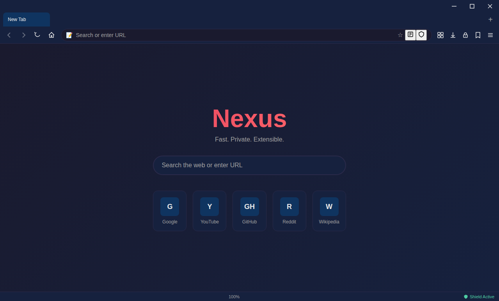
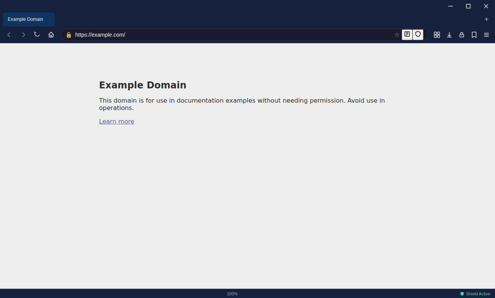
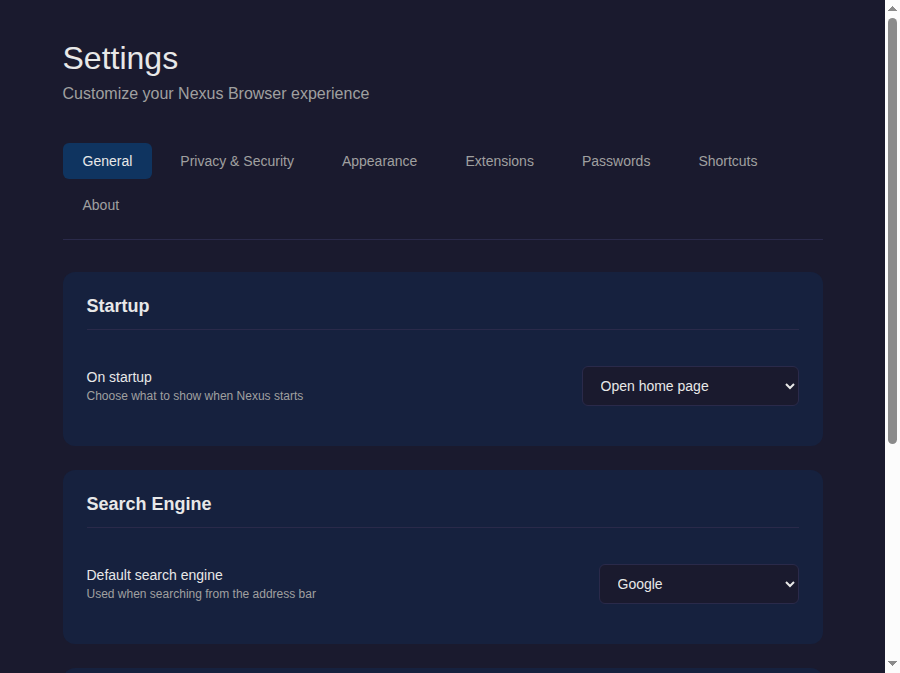

# Nexus Browser

A next-generation Chromium-based browser with full Chrome Web Store extension support, built on Electron.

## Screenshots

### Home Page


### Loaded Page


### Settings


## Features

- **Chrome Web Store Support**: Install extensions directly from the Chrome Web Store
- **Privacy Shield**: Built-in tracker and ad blocker with 45+ tracker domains and 20+ ad networks
- **Password Manager**: AES-256-GCM encrypted password vault with master password protection
- **Reading Mode**: Distraction-free article reading with light/dark/sepia themes
- **Download Manager**: Download tracking with pause/resume support
- **Tab Management**: Multi-tab browsing with per-tab webviews
- **Bookmarks**: Full bookmark system with localStorage persistence
- **Zoom Controls**: Zoom in/out/reset with display
- **Custom Blocklists**: Add custom domains to block or whitelist

## Prerequisites

- Node.js 18+
- npm 9+

## Installation

```bash
npm install
```

## Development

```bash
npm start          # Run in development
npm run dev        # Run with dev flags
```

## Building

```bash
npm run build              # Build for current platform
npm run build:win          # Build for Windows
npm run build:mac          # Build for macOS
npm run build:linux        # Build for Linux
npm run build:all          # Build for all platforms
npm run build:offline      # Build Windows offline installer (.exe)
npm run build-installer    # Run full installer build script
npm run package            # Build without publishing
```

### Offline Windows Installer

To create a fully offline Windows installer that does not require internet access:

```bash
npm run build:offline
```

This produces `dist/Nexus Browser-Setup-1.0.0.exe` - a self-contained installer that includes:
- All application files
- All dependencies (bundled in the asar archive)
- NSIS installer with custom installation options
- Desktop and Start Menu shortcuts
- Uninstaller

The installer can be distributed and installed on any Windows machine without requiring Node.js, npm, or internet access.

## Testing & Linting

```bash
npm test           # Run tests
npm run test:watch # Watch mode
npm run lint       # Run ESLint
npm run lint:fix   # Fix ESLint issues
npm run format     # Format with Prettier
```

## Keyboard Shortcuts

| Shortcut | Action |
|----------|--------|
| Ctrl+T | New tab |
| Ctrl+W | Close tab |
| Ctrl+L | Focus URL bar |
| Ctrl+R | Refresh |
| Ctrl++ | Zoom in |
| Ctrl+- | Zoom out |
| Ctrl+0 | Reset zoom |
| Ctrl+D | Bookmark page |

## Project Structure

```
browser/
├── package.json                    # Project config, dependencies, build scripts
├── electron-builder.yml            # Electron-builder configuration for offline installer
├── README.md                       # User-facing documentation
├── LICENSE                         # MIT License
├── .gitignore                      # Git ignore rules
├── assets/
│   └── icon.svg                    # Application icon (SVG source)
├── src/
│   ├── main.js                     # Electron main process
│   ├── preload.js                  # Preload script for secure IPC
│   ├── ui/
│   │   ├── browser.html            # Main browser window HTML
│   │   ├── browser.js              # Browser UI logic (tabs, navigation, panels)
│   │   ├── styles.css              # Complete UI styling (dark theme)
│   │   └── settings.html           # Settings window
│   ├── extensions/
│   │   ├── extension-manager.js    # Chrome extension installation/management
│   │   ├── chrome-webstore-bridge.js # Chrome Web Store CRX download/extraction
│   │   └── permission-manager.js   # Extension permission analysis
│   └── features/
│       ├── privacy-shield.js       # Built-in tracker/ad blocker
│       ├── download-manager.js     # Download handling with pause/resume
│       ├── reading-mode.js         # Distraction-free reading view
│       └── password-manager.js     # Encrypted password vault
├── build/
│   └── installer.nsh               # NSIS custom installer script
├── scripts/
│   └── build-installer.js          # Automated offline installer build script
└── installers/
    ├── windows/                    # Windows installer scripts (legacy)
    └── linux/                      # Linux installer scripts (legacy)
```

## Architecture

### Extension Support
1. **Direct CRX Installation**: Download .crx files from Chrome Web Store API
2. **Local Extension Loading**: Load unpacked extensions from filesystem
3. **Session API**: Use Electron's session.loadExtension() for runtime loading
4. **Permission Analysis**: Analyze manifest permissions before install

### Privacy Shield
- Blocks 45+ tracker domains by default
- Blocks 20+ ad networks by default
- Custom blocklist and whitelist support
- Header manipulation (remove tracking headers, modify cookies)
- Request blocking statistics

### Password Security
- AES-256-GCM encryption with PBKDF2 key derivation (100k iterations)
- Master password protection
- Per-password random key encryption
- Import/Export with encrypted CSV

## License

MIT
